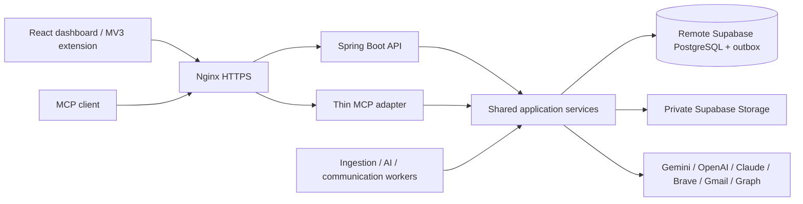

# MyJobAI

A cost-conscious job-search workspace: capture or discover opportunities, match them to verified experience, prepare deterministic PDF/DOCX resumes, research public recruiting contacts, review outreach, and track applications. **No email is sent without approval of the exact message, recipient and attachment.** LinkedIn and WhatsApp drafts are copied for manual sending.

**V1 verification:** the local acceptance run passed 49 backend tests, five web tests, eight extension tests, three configuration tests and four browser scenarios. Docker startup, health checks, data/file persistence across restart, and local Nginx TLS syntax were exercised. Live provider access and EC2 deployment need your accounts and configuration. See the dated [implementation evidence](docs/IMPLEMENTATION_STATUS.md) for delivery status and limitations.

## What you can do

| Capability | V1 behavior |
|---|---|
| Candidate workspace | Structured profile, preferences, resume uploads and explicitly verified experience facts |
| Opportunities | Public Greenhouse/Lever/Ashby feeds, structured career pages, manual imports and user-triggered browser capture; canonical deduplication retains source provenance |
| Matching | Hard filters and configurable weighted ranking with skills, gaps, freshness, referral and reachability explanations |
| Resume preparation | PDF/DOCX parsing, source-line review, fact selection, deterministic versioned PDF/DOCX output and internal compatibility/parseability checks |
| Recruiter research | Public-source contact evidence, confidence and verification status; optional Brave search |
| Outreach | Email, LinkedIn and WhatsApp drafts; exact recipient/message/resume approval before Gmail or Outlook queuing |
| Tracking | Validated application transitions, immutable history, background-task visibility and basic analytics |
| AI clients | One authenticated MCP server sharing application services with REST |

The backend uses Java 21 and Spring Boot, PostgreSQL/Flyway and a transactional outbox. The dashboard and Chrome MV3 extension use React and TypeScript. Gemini, OpenAI and Claude adapters are selected through configuration.

## Quick start: isolated local acceptance mode

Prerequisites: Git, Java **21+ JDK**, Maven 3.9+, Node **22+**, Docker with Linux containers and Compose **2.24.4+**. Allow roughly 4 GB for application containers plus build headroom. Complete repository-local Git setup first; do not put credentials in chat or source files.

```bash
git clone https://github.com/akshatjain04/job-search-platform
cd job-search-platform
git config --local user.email "akshatjain0410@gmail.com"
git config --local user.name "YOUR_GITHUB_NAME"
# Use secure GitHub authentication; see docs/git-bootstrap.md.
./scripts/bootstrap-and-run.sh --demo
```

Windows PowerShell:

```powershell
.\scripts\bootstrap-and-run.ps1 -Demo
```

Run the same clone and repository-local identity setup first on Windows. If Java 17 is your default, select the installed JDK for this terminal before starting:

```powershell
$env:JAVA_HOME = 'C:\Program Files\Java\jdk-21' # adjust to your installed JDK
$env:PATH = "$env:JAVA_HOME\bin;$env:PATH"
java -version
```

This builds and tests the backend, dashboard and extension, builds images, starts all services, waits for health, and runs smoke checks. The explicit demo configuration uses isolated PostgreSQL, private local-test object storage, deterministic AI, and a **non-sending mailbox**. Enter an email on the local login screen; this is not production authentication. Production never includes this local database or test authentication.

Open **http://localhost:8080**. Create a profile and verified facts, upload a PDF/DOCX, then capture a job. See [manual acceptance](docs/testing.md). No external accounts are needed for this isolated mode.

### First application workflow

1. Sign in with a test email and open **My profile**. Save your identity/preferences and add a reviewed experience fact with its source.
2. Upload a text PDF or DOCX in **Resumes**. Review extracted sections; uploading does not automatically verify facts.
3. Capture an opportunity, open its details and calculate the match. Select a base resume and request tailoring.
4. Follow the task in **Activity**, then download the versioned resume and inspect its score and source facts.
5. Research or enter a source-backed recruiting contact and generate outreach. Review the exact email and attachment in **Outreach**, explicitly approve, then queue.
6. In demo mode the worker records a test send. Inspect **Applications** and **Insights** for history and results.

## Production on one EC2 instance

Production uses Supabase PostgreSQL, Supabase Auth and a private Supabase Storage bucket. Copy `.env.example` to `.env`; configure Supabase, a random encryption key, **one** active AI provider and HTTPS. Gemini is the default; OpenAI and Claude are interchangeable. Inactive provider keys are optional. Gmail, Outlook and Brave search are optional integrations enabled through their own configuration.

```bash
cp .env.example .env
# Edit .env securely; provision TLS and external accounts first.
node scripts/platform.mjs preflight
./scripts/bootstrap-and-run.sh
# Or build/test locally and deliver to an already provisioned EC2 host:
./scripts/deploy-ec2.sh ubuntu@YOUR_EC2_HOST /opt/myjobai
```

The production startup fails early with missing configuration names. It does not create accounts, purchase infrastructure, register OAuth apps or manufacture certificates. See [configuration](docs/configuration.md), [Supabase](docs/supabase-setup.md), [OAuth](docs/oauth-setup.md), [AI providers](docs/ai-provider-setup.md), and [EC2 deployment](docs/ec2-deployment.md).

| External setup | Required configuration | When needed |
|---|---|---|
| Supabase project, database, private bucket and Auth provider | `SUPABASE_DB_URL`, `SUPABASE_DB_USER`, `SUPABASE_DB_PASSWORD`, `SUPABASE_URL`, `SUPABASE_ANON_KEY`, `SUPABASE_SERVICE_ROLE_KEY`, `STORAGE_BUCKET` | Production |
| Application encryption key | `ENCRYPTION_MASTER_KEY`: base64-encoded 32 random bytes, backed up securely | Production sessions and mailbox tokens |
| Selected AI provider | `LLM_PROVIDER` plus its API key and cheap/medium/high model IDs | Production AI; inactive providers stay optional |
| Public origin and TLS files | `APP_PUBLIC_URL`, `TLS_DIRECTORY` | Production HTTPS; key readable by Nginx UID/GID 101 |
| Brave account | `BRAVE_SEARCH_API_KEY` | Optional public-web recruiter search |
| Google/Microsoft OAuth application | `GMAIL_CLIENT_ID/SECRET` or `MICROSOFT_CLIENT_ID/SECRET`, tenant as applicable | Optional connected mailbox sending |
| Existing EC2 host, Docker, Node and SSH access | Deployment command's `USER@HOST`; remote `/opt/myjobai/.env` and TLS directory | EC2 delivery |

Copying the example file does not create valid credentials. Keep `.env` and encryption backups out of Git. Supabase setup and OAuth redirect registrations are described in the linked guides; remote production PostgreSQL is never provisioned inside this Compose stack.

## Components



All compute runs in Docker Compose on one replaceable EC2 host. No Redis, Kafka, Kubernetes, OpenSearch, vector database, mandatory RAG or SQS.

```text
backend/       Maven modules: domain, application, persistence, connectors,
               AI, resume, storage, mail, runtime; API + MCP + three workers
web/           React / TypeScript dashboard and Playwright acceptance tests
extension/     React / TypeScript Manifest V3 contextual client
infra/         Multi-stage images and Nginx HTTP/TLS configuration
scripts/       Cross-platform preflight, build/test/start/stop/smoke/deployment
docs/          Architecture, acceptance criteria, evidence and operations
skills/        Portable repository audit/repair Skill with validation helpers
AGENTS.md      Entry point for coding agents working in this checkout
```

## Daily commands

```bash
node scripts/platform.mjs test --demo       # backend + web + extension suites
node scripts/platform.mjs build --demo      # same verified build gate
node scripts/platform.mjs start --demo      # existing images, health + smoke
node scripts/platform.mjs stop --demo       # preserves data and objects
node scripts/platform.mjs smoke --demo
node scripts/verify-repository.mjs          # secrets/boundaries/V1 checks
cd web && npm run e2e                       # requires running local test stack
```

Use commands without `--demo` for configured production. `--skip-tests` is explicit and is **not** an acceptance pass. Maven tests need Docker for isolated PostgreSQL; none makes a billable LLM call or sends real email. Run `npx playwright install chromium` once inside `web` for browser testing.

Endpoints: `/api/v1`, authenticated OpenAPI `/v3/api-docs`, API readiness `/api-health`, MCP `/mcp`. Worker/internal ports are not published.

| Local demo surface | Address |
|---|---|
| Dashboard | `http://localhost:8080` |
| REST API | `http://localhost:8080/api/v1` |
| OpenAPI JSON (sign in first) | `http://localhost:8080/v3/api-docs` |
| Readiness | `http://localhost:8080/api-health` |
| MCP Streamable HTTP | `http://localhost:8080/mcp` |
| Extension artifact | `extension/dist` or `http://localhost:8080/myjobai-extension.zip` |

### Complete local acceptance gate

```bash
./scripts/bootstrap-and-run.sh --demo
npm ci
npm run audit:repository
npm run format:check
mvn -f backend/pom.xml -Pformat spotless:check
npm exec --prefix web -- playwright install chromium
npm run e2e --prefix web
node scripts/restart-test.mjs
```

On Windows use the PowerShell bootstrap above and `npm.cmd`/`mvn.cmd` if script execution policy blocks command shims. Testcontainers validates Flyway against fresh PostgreSQL databases. Reports are in `backend/*/target/surefire-reports`, `web/playwright-report` and `web/test-results`. See [testing](docs/testing.md) for individual suites, font prerequisites and manual/live checks.

## Independent audit and repair

Acceptance criteria: [docs/ACCEPTANCE_CRITERIA.md](docs/ACCEPTANCE_CRITERIA.md). Actual verification evidence and remaining limits: [docs/IMPLEMENTATION_STATUS.md](docs/IMPLEMENTATION_STATUS.md).

The reusable skill is the complete folder [skills/job-search-platform-repair](skills/job-search-platform-repair/SKILL.md). Copy that folder into your personal Codex skills directory to install it, or provide its `SKILL.md` path with the repository. The package uses repository documents as the source of truth and includes architecture extraction and validation helpers.

Use the whole folder, including `references`, `scripts` and `agents`. Its checks can also run from this repository root:

```bash
node skills/job-search-platform-repair/scripts/validate.mjs --root=. --static
node skills/job-search-platform-repair/scripts/validate.mjs --root=. --full
```

The full helper builds and tests, starts the non-sending demo stack, runs browser and restart checks, and leaves the stack running for inspection. It writes command evidence to ignored `.local/audit/latest.json`; the agent must still inspect contracts and security and assess every acceptance criterion. It never automatically declares semantic acceptance from successful commands.

First prompt:

> Use $job-search-platform-repair from skills/job-search-platform-repair/SKILL.md to audit, repair and complete this repository. Read the original architecture, master specification, acceptance criteria and current status. Inspect the actual code, run the executable gates, prove and fix gaps, and repeat until no BLOCKER or HIGH implementation gaps remain. Preserve the cost-optimized V1 architecture and approval/security invariants. Update status with actual evidence, identify credential-only live verification limits, and commit/push meaningful tested repairs using repository-local Git configuration.

## Extension and MCP

Load `extension/dist` unpacked in `chrome://extensions`, or download `/myjobai-extension.zip` and unpack it. Register its ID in `EXTENSION_IDS`, sign in to the dashboard in the same browser, and click **Connect securely**. The extension requests access only to your configured platform origin and uses `activeTab` for a user-initiated capture. It has no crawler/background script. See [extension guide](docs/chrome-extension.md).

Generate a short-lived MCP bearer token in Connections. Configure your MCP client's Streamable HTTP URL as `https://YOUR_DOMAIN/mcp` with an Authorization header. Tokens expire after one hour and logout revokes issued tokens. No arbitrary-email sender is exposed. See [MCP guide](docs/mcp.md).

## Truth, safety and operating cost

The candidate profile is canonical; uploaded text is evidence, not automatically verified truth. V1 AI selects/reorders verified facts, while deterministic templates preserve claims verbatim. Internal compatibility is an explainable proxy, **not an employer ATS guarantee**. Missing skills are reported rather than fabricated. An uncertain mailbox response requires manual reconciliation, not a blind retry.

Recurring costs: EC2/EBS/network, your Supabase plan and storage, selected LLM usage, optional search and domain. OAuth mailbox/API quotas and account policies apply. PostgreSQL caches outputs and enforces a daily per-user AI call budget; fallback is disabled. See [cost controls](docs/cost-controls.md).

### Known V1 limits

- Resume tailoring selects/reorders verified statements and renders them verbatim. Unrestricted AI paraphrasing, OCR and universal writing-system/font support are not implemented.
- Compatibility scoring is an internal lexical proxy. It cannot guarantee an employer's ATS result.
- Social drafts and job applications are submitted manually. Unlicensed portal crawling and automated social actions are not required integrations.
- Analytics are descriptive associations, not causal performance claims. Paid/phone enrichment and the optional scaling infrastructure are future work.
- Real OAuth, provider delivery, unpacked-extension identity flow and EC2/public TLS need their respective live acceptance checks.

### Common startup problems

| Symptom | Action |
|---|---|
| Repository/email preflight error | Check exact `origin` and `git config --local user.email`; follow [Git setup](docs/git-bootstrap.md) |
| Java version/enforcer failure | Select Java 21 in the current terminal and verify `java -version` and `mvn -version` |
| PostgreSQL tests cannot start | Start Docker and select Linux containers; do not skip the integration suite |
| Missing selected AI configuration | Fill only the active provider key and all three model IDs, or use explicit `--demo` |
| Nginx cannot read TLS key | Set the deployed key permissions for UID/GID 101 as described in [EC2 deployment](docs/ec2-deployment.md) |
| Resume extraction fails | Supply a text-bearing PDF/DOCX; scanned/image-only documents require conversion outside V1 |
| Unknown email delivery result | Check the provider's sent folder and use explicit reconciliation; do not blindly requeue |

For recovery and operation, start with [troubleshooting](docs/troubleshooting.md), [backup and recovery](docs/backup-and-recovery.md), [operations](docs/operations.md), [security](docs/security.md) and [scaling triggers](docs/scale-up-triggers.md).

Before treating any build as accepted, consult [ACCEPTANCE_CRITERIA.md](docs/ACCEPTANCE_CRITERIA.md) and the evidence in [IMPLEMENTATION_STATUS.md](docs/IMPLEMENTATION_STATUS.md). Live external-provider checks require your credentials and separate authorization; they are not implied by mocked acceptance tests.
