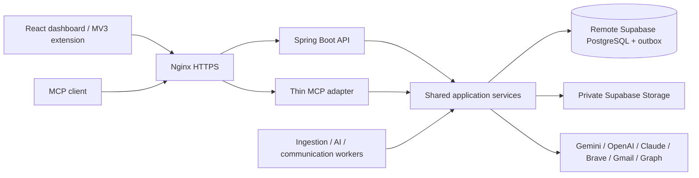

# MyJobAI

A cost-conscious job-search workspace: capture or discover opportunities, match them to verified experience, prepare deterministic PDF/DOCX resumes, research public recruiting contacts, review outreach, and track applications. **No email is sent without approval of the exact message, recipient and attachment.** LinkedIn and WhatsApp drafts are copied for manual sending.

## Quick start: isolated local acceptance mode

Prerequisites: Git, Java **21+ JDK**, Maven 3.9+, Node **22+**, Docker with Linux containers and Compose **2.24.4+**. Allow roughly 4 GB for application containers plus build headroom. Complete repository-local Git setup first; do not put credentials in chat or source files.

```bash
git clone https://github.com/akshatjain04/job-search-platform
cd job-search-platform
git config --local user.email "akshatjain0410@gmail.com"
git config --local user.name "YOUR_GITHUB_NAME"
# Use secure GitHub authentication; see docs/git-bootstrap.md.
./scripts/bootstrap-and-run.sh --demo
```

Windows PowerShell:

```powershell
.\scripts\bootstrap-and-run.ps1 -Demo
```

This builds and tests the backend, dashboard and extension, builds images, starts all services, waits for health, and runs smoke checks. The explicit demo configuration uses isolated PostgreSQL, private local-test object storage, deterministic AI, and a **non-sending mailbox**. Enter an email on the local login screen; this is not production authentication. Production never includes this local database or test authentication.

Open **http://localhost:8080**. Create a profile and verified facts, upload a PDF/DOCX, then capture a job. See [manual acceptance](docs/testing.md). No external accounts are needed for this isolated mode.

## Production on one EC2 instance

Production uses Supabase PostgreSQL, Supabase Auth and a private Supabase Storage bucket. Copy `.env.example` to `.env`; configure Supabase, a random encryption key, **one** active AI provider and HTTPS. Gemini is the default; OpenAI and Claude are interchangeable. Inactive provider keys are optional. Gmail, Outlook and Brave search are optional integrations enabled through their own configuration.

```bash
cp .env.example .env
# Edit .env securely; provision TLS and external accounts first.
node scripts/platform.mjs preflight
./scripts/bootstrap-and-run.sh
# Or build/test locally and deliver to an already provisioned EC2 host:
./scripts/deploy-ec2.sh ubuntu@YOUR_EC2_HOST /opt/myjobai
```

The production startup fails early with missing configuration names. It does not create accounts, purchase infrastructure, register OAuth apps or manufacture certificates. See [configuration](docs/configuration.md), [Supabase](docs/supabase-setup.md), [OAuth](docs/oauth-setup.md), [AI providers](docs/ai-provider-setup.md), and [EC2 deployment](docs/ec2-deployment.md).

## Components



All compute runs in Docker Compose on one replaceable EC2 host. No Redis, Kafka, Kubernetes, OpenSearch, vector database, mandatory RAG or SQS.

```text
backend/       Maven modules: domain, application, persistence, connectors,
               AI, resume, storage, mail, runtime; API + MCP + three workers
web/           React / TypeScript dashboard and Playwright acceptance tests
extension/     React / TypeScript Manifest V3 contextual client
infra/         Multi-stage images and Nginx HTTP/TLS configuration
scripts/       Cross-platform preflight, build/test/start/stop/smoke/deployment
docs/          Architecture, acceptance criteria, evidence and operations
```

## Daily commands

```bash
node scripts/platform.mjs test --demo       # backend + web + extension suites
node scripts/platform.mjs build --demo      # same verified build gate
node scripts/platform.mjs start --demo      # existing images, health + smoke
node scripts/platform.mjs stop --demo       # preserves data and objects
node scripts/platform.mjs smoke --demo
node scripts/verify-repository.mjs          # secrets/boundaries/V1 checks
cd web && npm run e2e                       # requires running local test stack
```

Use commands without `--demo` for configured production. `--skip-tests` is explicit and is **not** an acceptance pass. Maven tests need Docker for isolated PostgreSQL; none makes a billable LLM call or sends real email. Run `npx playwright install chromium` once inside `web` for browser testing.

Endpoints: `/api/v1`, authenticated OpenAPI `/v3/api-docs`, API readiness `/api-health`, MCP `/mcp`. Worker/internal ports are not published.

## Independent audit and repair

Acceptance criteria: [docs/ACCEPTANCE_CRITERIA.md](docs/ACCEPTANCE_CRITERIA.md). Actual verification evidence and remaining limits: [docs/IMPLEMENTATION_STATUS.md](docs/IMPLEMENTATION_STATUS.md).

The reusable skill is the complete folder [skills/job-search-platform-repair](skills/job-search-platform-repair/SKILL.md). Copy that folder into your personal Codex skills directory to install it, or provide its `SKILL.md` path with the repository. The package uses repository documents as the source of truth and includes architecture extraction and validation helpers.

First prompt:

> Use $job-search-platform-repair from skills/job-search-platform-repair/SKILL.md to audit, repair and complete this repository. Read the original architecture, master specification, acceptance criteria and current status. Inspect the actual code, run the executable gates, prove and fix gaps, and repeat until no BLOCKER or HIGH implementation gaps remain. Preserve the cost-optimized V1 architecture and approval/security invariants. Update status with actual evidence, identify credential-only live verification limits, and commit/push meaningful tested repairs using repository-local Git configuration.

## Extension and MCP

Load `extension/dist` unpacked in `chrome://extensions`, or download `/myjobai-extension.zip` and unpack it. Register its ID in `EXTENSION_IDS`, sign in to the dashboard in the same browser, and click **Connect securely**. The extension requests access only to your configured platform origin and uses `activeTab` for a user-initiated capture. It has no crawler/background script. See [extension guide](docs/chrome-extension.md).

Generate a short-lived MCP bearer token in Connections. Configure your MCP client's Streamable HTTP URL as `https://YOUR_DOMAIN/mcp` with an Authorization header. Tokens expire after one hour and logout revokes issued tokens. No arbitrary-email sender is exposed. See [MCP guide](docs/mcp.md).

## Truth, safety and operating cost

The candidate profile is canonical; uploaded text is evidence, not automatically verified truth. V1 AI selects/reorders verified facts, while deterministic templates preserve claims verbatim. Internal compatibility is an explainable proxy, **not an employer ATS guarantee**. Missing skills are reported rather than fabricated. An uncertain mailbox response requires manual reconciliation, not a blind retry.

Recurring costs: EC2/EBS/network, your Supabase plan and storage, selected LLM usage, optional search and domain. OAuth mailbox/API quotas and account policies apply. PostgreSQL caches outputs and enforces a daily per-user AI call budget; fallback is disabled. See [cost controls](docs/cost-controls.md).

Before treating any build as accepted, consult [ACCEPTANCE_CRITERIA.md](docs/ACCEPTANCE_CRITERIA.md) and the evidence in [IMPLEMENTATION_STATUS.md](docs/IMPLEMENTATION_STATUS.md). Live external-provider checks require your credentials and separate authorization; they are not implied by mocked acceptance tests.
